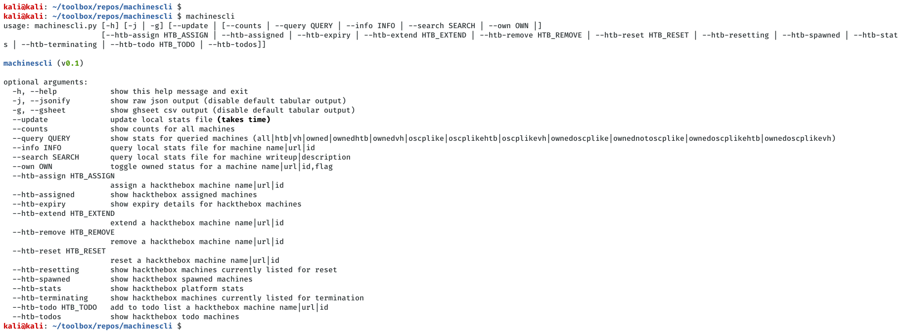
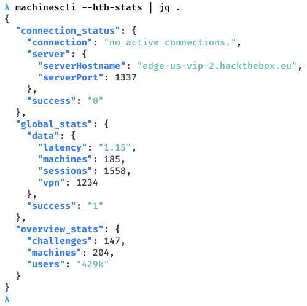
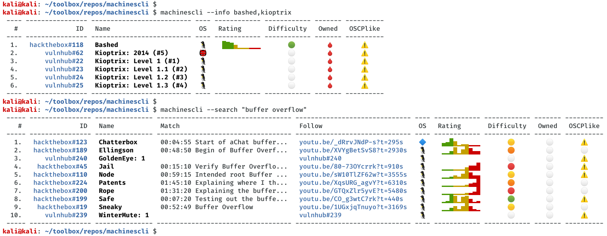
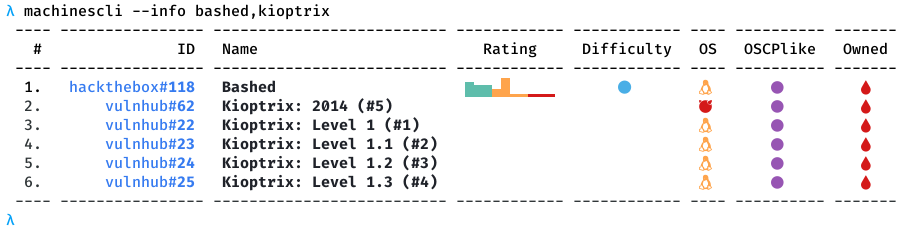
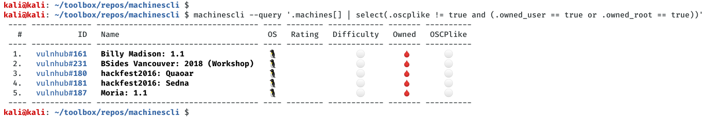

# machinescli

[](https://creativecommons.org/licenses/by/4.0/)

This tool provides commandline access for HackTheBox and VulnHub machines. It can be useful for looking up machine details, interacting with HackTheBox portal, tracking owned/pending machines, etc. It also provides commandline based, [ippsec.rocks](https://ippsec.rocks/?#) like search facility for writeup descriptions and extends it to VulnHub machines as well. It works in conjuction with [svachal](https://github.com/7h3rAm/svachal) framework so all machine writeups metadata is natively accessible:

## Usage
```console
$ machinescli 
usage: machinescli.py [-h] [-j | -g] [--update | [--counts | --query QUERY | --info INFO | --search SEARCH | --own OWN |]
                      [--htb-assign HTB_ASSIGN | --htb-assigned | --htb-expiry | --htb-extend HTB_EXTEND | --htb-remove HTB_REMOVE | --htb-reset HTB_RESET | --htb-resetting | --htb-spawned | --htb-stats | --htb-terminating | --htb-todo HTB_TODO | --htb-todos]]

machinescli (v0.1)

optional arguments:
  -h, --help            show this help message and exit
  -j, --jsonify         show raw json output (disable default tabular output)
  -g, --gsheet          show ghseet csv output (disable default tabular output)
  --update              update local stats file (takes time)
  --counts              show counts for all machines
  --query QUERY         show stats for queried machines (all|htb|vh|owned|ownedhtb|ownedvh|oscplike|oscplikehtb|oscplikevh|ownedoscplike|ownednotoscplike|ownedoscplikehtb|ownedoscplikevh)
  --info INFO           query local stats file for machine name|url|id
  --search SEARCH       query local stats file for machine writeup|description
  --own OWN             toggle owned status for a machine name|url|id,flag
  --htb-assign HTB_ASSIGN
                        assign a hackthebox machine name|url|id
  --htb-assigned        show hackthebox assigned machines
  --htb-expiry          show expiry details for hackthebox machines
  --htb-extend HTB_EXTEND
                        extend a hackthebox machine name|url|id
  --htb-remove HTB_REMOVE
                        remove a hackthebox machine name|url|id
  --htb-reset HTB_RESET
                        reset a hackthebox machine name|url|id
  --htb-resetting       show hackthebox machines currently listed for reset
  --htb-spawned         show hackthebox spawned machines
  --htb-stats           show hackthebox platform stats
  --htb-terminating     show hackthebox machines currently listed for termination
  --htb-todo HTB_TODO   add to todo list a hackthebox machine name|url|id
  --htb-todos           show hackthebox todo machines
```

## Usecases
1. Show counts for tracked and owned machines:
```console
$ machinescli --counts 
 ---------- ----------------- ----------------- ---------------- ----------------- 
     #                 Total        HackTheBox          VulnHub          OSCPlike  
 ---------- ----------------- ----------------- ---------------- ----------------- 
   Total      46/646 (7.12%)   23/169 (13.61%)   23/477 (4.82%)   41/152 (26.97%)  
  Windows     11/54 (20.37%)    22/52 (42.31%)      0/2 (0.00%)    11/31 (35.48%)  
    *nix      35/592 (5.91%)   24/117 (20.51%)   46/475 (9.68%)   35/121 (28.93%)  
  OSCPlike   41/152 (26.97%)    23/70 (32.86%)   18/82 (21.95%)                    
 ---------- ----------------- ----------------- ---------------- ----------------- 
```

1. Show global stats from HackTheBox platform:
```json
$ machinescli --htb-stats 
{
  "connection_status": {
    "connection": "no active connections.",
    "server": {
      "serverHostname": "edge-us-vip-2.hackthebox.eu",
      "serverPort": 1337
    },
    "success": "0"
  },
  "global_stats": {
    "data": {
      "latency": "1.18",
      "machines": 169,
      "sessions": 1494,
      "vpn": 1560
    },
    "success": "1"
  },
  "overview_stats": {
    "challenges": 128,
    "machines": 180,
    "users": "358k"
  }
}
```

1. Show stats for machines named `bashed` and `kioptirx`:
```console
$ machinescli --info bashed,kioptrix
 ---- ---------------- -------------------------- ---- ------------ ------------ ------- ---------- 
   #               ID   Name                       OS   Rating       Difficulty   Owned   OSCPlike  
 ---- ---------------- -------------------------- ---- ------------ ------------ ------- ---------- 
  1.   hackthebox#118   Bashed                     🐧    █▇▆▄▁▁▁▁▁▁       🟢        🩸       ⚠️        
  2.       vulnhub#62   Kioptrix: 2014 (#5)        👹                     ⚪        🩸       ⚠️        
  3.       vulnhub#22   Kioptrix: Level 1 (#1)     🐧                     ⚪        🩸       ⚠️        
  4.       vulnhub#23   Kioptrix: Level 1.1 (#2)   🐧                     ⚪        🩸       ⚠️        
  5.       vulnhub#24   Kioptrix: Level 1.2 (#3)   🐧                     ⚪        🩸       ⚠️        
  6.       vulnhub#25   Kioptrix: Level 1.3 (#4)   🐧                     ⚪        🩸       ⚠️        
 ---- ---------------- -------------------------- ---- ------------ ------------ ------- ----------
 ```

2. Search within machine descriptions for keyword `buffer overflow`:
```console
$ machinescli --search "buffer overflow"
 ----- ---------------- --------------- ----------------------------------- ------------------------------ ---- ------------ ------------ ------- ---------- 
    #               ID   Name            Match                               Follow                         OS   Rating       Difficulty   Owned   OSCPlike  
 ----- ---------------- --------------- ----------------------------------- ------------------------------ ---- ------------ ------------ ------- ---------- 
   1.   hackthebox#123   Chatterbox      00:04:55 Start of aChat buffer...   youtu.be/_dRrvJNdP-s?t=295s    🔷    ▃▄█▅▁▂▂▁▁▁       🟡        ⚪       ⚠️        
   2.   hackthebox#189   Ellingson       00:48:50 Begin of Buffer Overf...   youtu.be/XVYgBetSvS8?t=2930s   🐧    ▁▁▃▇▁▅█▆▃▃       🟠        ⚪       ⚪         
   3.      vulnhub#240   GoldenEye: 1                                        vulnhub#240                    🐧                     ⚪        ⚪       ⚠️        
   4.    hackthebox#45   Jail            00:15:10 Verify Buffer Overflo...   youtu.be/80-73OYcrrk?t=910s    🐧    ▁▁▁▁▁▁▃▅▅█       🔴        ⚪       ⚠️        
   5.   hackthebox#110   Node            00:59:15 Intended root Buffer ...   youtu.be/sW10TlZF62w?t=3555s   🐧    ▁▁▂▃▂▅█▆▃▃       🟡        ⚪       ⚠️        
   6.   hackthebox#224   Patents         01:45:10 Explaining where I th...   youtu.be/XqsURG_agvY?t=6310s   🐧    ▁▁▁▁▁▁▂▃▄█       🟠        ⚪       ⚪         
   7.   hackthebox#200   Rope            01:31:20 Explaining the buffer...   youtu.be/GTQxZlr5yvE?t=5480s   🐧    ▁▁▁▁▁▁▂▂▃█       🔴        ⚪       ⚪         
   8.   hackthebox#199   Safe            00:07:20 Testing out the buffe...   youtu.be/CO_g3wtC7rk?t=440s    🐧    ▁▂█▇▁▆▇▄▁▂       🟢        ⚪       ⚠️        
   9.    hackthebox#19   Sneaky          00:52:49 Buffer Overflow            youtu.be/1UGxjqTnuyo?t=3169s   🐧    ▁▁▃▅▂▅█▅▂▁       🟡        ⚪       ⚪         
  10.      vulnhub#239   WinterMute: 1                                       vulnhub#239                    🐧                     ⚪        ⚪       ⚠️        
 ----- ---------------- --------------- ----------------------------------- ------------------------------ ---- ------------ ------------ ------- ---------- 
```

3. Summarize all writeups:
```console
$ machinescli --query owned
 ----- ---------------- ----------------------------------- ---- ------------ ------------ ------- ---------- 
    #               ID   Name                                OS   Rating       Difficulty   Owned   OSCPlike  
 ----- ---------------- ----------------------------------- ---- ------------ ------------ ------- ---------- 
   1.   hackthebox#148   Active                              🔷    ▁▃█▇▂▃▃▂▁▁       🟢        🩸       ⚠️        
   2.     hackthebox#9   Arctic                              🔷    ▂▄█▆▁▂▁▁▁▁       🟢        🩸       ⚠️        
   3.   hackthebox#118   Bashed                              🐧    █▇▆▄▁▁▁▁▁▁       🟢        🩸       ⚠️        
   4.     hackthebox#5   Beep                                🐧    ▄▅█▄▁▁▁▁▁▁       🟢        🩸       ⚠️        
   5.      vulnhub#161   Billy Madison: 1.1                  🐧                     ⚪        🩸       ⚪         
   6.    hackthebox#48   Blocky                              🐧    ▇▆█▄▁▁▁▁▁▁       🟢        🩸       ⚠️        
   7.    hackthebox#51   Blue                                🔷    █▄▂▁▁▁▁▁▁▁       🟢        🩸       ⚠️        
   8.   hackthebox#142   Bounty                              🔷    ▂▃▆█▂▃▃▂▁▁       🟢        🩸       ⚠️        
   9.       vulnhub#51   Brainpan: 1                         🐧                     ⚪        🩸       ⚠️        
  10.      vulnhub#231   BSides Vancouver: 2018 (Workshop)   🐧                     ⚪        🩸       ⚪         
  11.    hackthebox#11   Cronos                              🐧    ▂▄█▇▂▂▂▁▁▁       🟡        🩸       ⚠️        
  12.      vulnhub#315   DC: 6                               🐧                     ⚪        🩸       ⚠️        
  13.     hackthebox#3   Devel                               🔷    ▃▅█▄▁▁▁▁▁▁       🟢        🩸       ⚠️        
  14.      vulnhub#323   Escalate_Linux: 1                   🐧                     ⚪        🩸       ⚠️        
  15.   hackthebox#173   FriendZone                          🐧    ▁▁▅█▂▆▆▃▁▁       🟢        🩸       ⚠️        
  16.      vulnhub#133   FristiLeaks: 1.3                    🐧                     ⚪        🩸       ⚠️        
  17.    hackthebox#13   Grandpa                             🔷    ▄▆█▄▁▁▁▁▁▁       🟢        🩸       ⚠️        
  18.    hackthebox#14   Granny                              🔷    ▅▇█▄▁▁▁▁▁▁       🟢        🩸       ⚠️        
  19.      vulnhub#180   hackfest2016: Quaoar                🐧                     ⚪        🩸       ⚪         
  20.      vulnhub#181   hackfest2016: Sedna                 🐧                     ⚪        🩸       ⚪         
  21.       vulnhub#48   HackLAB: Vulnix                     🐧                     ⚪        🩸       ⚠️        
  22.      vulnhub#330   hackme: 1                           🐧                     ⚪        🩸       ⚠️        
  23.      vulnhub#162   IMF: 1                              🐧                     ⚪        🩸       ⚠️        
  24.   hackthebox#163   Irked                               🐧    ▂▄█▇▂▃▂▁▁▁       🟢        🩸       ⚠️        
  25.   hackthebox#144   Jerry                               🔷    █▆▅▂▁▁▁▁▁▁       🟢        🩸       ⚠️        
  26.       vulnhub#62   Kioptrix: 2014 (#5)                 👹                     ⚪        🩸       ⚠️        
  27.       vulnhub#22   Kioptrix: Level 1 (#1)              🐧                     ⚪        🩸       ⚠️        
  28.       vulnhub#23   Kioptrix: Level 1.1 (#2)            🐧                     ⚪        🩸       ⚠️        
  29.       vulnhub#24   Kioptrix: Level 1.2 (#3)            🐧                     ⚪        🩸       ⚠️        
  30.       vulnhub#25   Kioptrix: Level 1.3 (#4)            🐧                     ⚪        🩸       ⚠️        
  31.   hackthebox#181   LaCasaDePapel                       🐧    ▁▁▅█▂▅▅▂▁▁       🟢        🩸       ⚠️        
  32.     hackthebox#1   Lame                                🐧    █▅▃▁▁▁▁▁▁▁       🟢        🩸       ⚠️        
  33.      vulnhub#205   LazySysAdmin: 1                     🐧                     ⚪        🩸       ⚠️        
  34.     hackthebox#2   Legacy                              🔷    █▄▂▁▁▁▁▁▁▁       🟢        🩸       ⚠️        
  35.      vulnhub#244   Lin.Security: 1                     🐧                     ⚪        🩸       ⚠️        
  36.      vulnhub#129   Lord Of The Root: 1.0.1             🐧                     ⚪        🩸       ⚠️        
  37.    hackthebox#64   Mirai                               🐧    ▅▆█▄▂▁▁▁▁▁       🟢        🩸       ⚠️        
  38.      vulnhub#371   Misdirection: 1                     🐧                     ⚪        🩸       ⚠️        
  39.      vulnhub#187   Moria: 1.1                          🐧                     ⚪        🩸       ⚪         
  40.      vulnhub#151   Mr-Robot: 1                         🐧                     ⚪        🩸       ⚠️        
  41.   hackthebox#177   Netmon                              🔷    ▇▃▃▂▁▁▁▁▁▁       🟢        🩸       ⚠️        
  42.      vulnhub#252   Node: 1                             🐧                     ⚪        🩸       ⚠️        
  43.     hackthebox#6   Optimum                             🔷    █▇▇▄▁▂▁▁▁▁       🟢        🩸       ⚠️        
  44.   hackthebox#111   Sense                               👹    ▆▆█▅▂▂▁▁▁▁       🟢        🩸       ⚠️        
  45.   hackthebox#108   Shocker                             🐧    ▄▅█▅▁▁▁▁▁▁       🟢        🩸       ⚠️        
  46.   hackthebox#127   Valentine                           🐧    ▂▄▇▇▂▂▂▁▁▁       🟢        🩸       ⚠️        
 ----- ---------------- ----------------------------------- ---- ------------ ------------ ------- ---------- 
```

4. Query writeups using built-in filters:
```console
$ machinescli --query ownedhtboscplike
 ----- ---------------- --------------- ---- ------------ ------------ ------- ---------- 
    #               ID   Name            OS   Rating       Difficulty   Owned   OSCPlike  
 ----- ---------------- --------------- ---- ------------ ------------ ------- ---------- 
   1.   hackthebox#148   Active          🔷    ▁▃█▇▂▃▃▂▁▁       🟢        🩸       ⚠️        
   2.     hackthebox#9   Arctic          🔷    ▂▄█▆▁▂▁▁▁▁       🟢        🩸       ⚠️        
   3.   hackthebox#118   Bashed          🐧    █▇▆▄▁▁▁▁▁▁       🟢        🩸       ⚠️        
   4.     hackthebox#5   Beep            🐧    ▄▅█▄▁▁▁▁▁▁       🟢        🩸       ⚠️        
   5.    hackthebox#48   Blocky          🐧    ▇▆█▄▁▁▁▁▁▁       🟢        🩸       ⚠️        
   6.    hackthebox#51   Blue            🔷    █▄▂▁▁▁▁▁▁▁       🟢        🩸       ⚠️        
   7.   hackthebox#142   Bounty          🔷    ▂▃▆█▂▃▃▂▁▁       🟢        🩸       ⚠️        
   8.    hackthebox#11   Cronos          🐧    ▂▄█▇▂▂▂▁▁▁       🟡        🩸       ⚠️        
   9.     hackthebox#3   Devel           🔷    ▃▅█▄▁▁▁▁▁▁       🟢        🩸       ⚠️        
  10.   hackthebox#173   FriendZone      🐧    ▁▁▅█▂▆▆▃▁▁       🟢        🩸       ⚠️        
  11.    hackthebox#13   Grandpa         🔷    ▄▆█▄▁▁▁▁▁▁       🟢        🩸       ⚠️        
  12.    hackthebox#14   Granny          🔷    ▅▇█▄▁▁▁▁▁▁       🟢        🩸       ⚠️        
  13.   hackthebox#163   Irked           🐧    ▂▄█▇▂▃▂▁▁▁       🟢        🩸       ⚠️        
  14.   hackthebox#144   Jerry           🔷    █▆▅▂▁▁▁▁▁▁       🟢        🩸       ⚠️        
  15.   hackthebox#181   LaCasaDePapel   🐧    ▁▁▅█▂▅▅▂▁▁       🟢        🩸       ⚠️        
  16.     hackthebox#1   Lame            🐧    █▅▃▁▁▁▁▁▁▁       🟢        🩸       ⚠️        
  17.     hackthebox#2   Legacy          🔷    █▄▂▁▁▁▁▁▁▁       🟢        🩸       ⚠️        
  18.    hackthebox#64   Mirai           🐧    ▅▆█▄▂▁▁▁▁▁       🟢        🩸       ⚠️        
  19.   hackthebox#177   Netmon          🔷    ▇▃▃▂▁▁▁▁▁▁       🟢        🩸       ⚠️        
  20.     hackthebox#6   Optimum         🔷    █▇▇▄▁▂▁▁▁▁       🟢        🩸       ⚠️        
  21.   hackthebox#111   Sense           👹    ▆▆█▅▂▂▁▁▁▁       🟢        🩸       ⚠️        
  22.   hackthebox#108   Shocker         🐧    ▄▅█▅▁▁▁▁▁▁       🟢        🩸       ⚠️        
  23.   hackthebox#127   Valentine       🐧    ▂▄▇▇▂▂▂▁▁▁       🟢        🩸       ⚠️        
 ----- ---------------- --------------- ---- ------------ ------------ ------- ---------- 
```

4. Query writeups using `jq` syntax:
```console
$ machinescli --query '.machines[] | select(.oscplike != true and (.owned_user == true or .owned_root == true))'
 ---- ------------- ----------------------------------- ---- -------- ------------ ------- ---------- 
   #            ID   Name                                OS   Rating   Difficulty   Owned   OSCPlike  
 ---- ------------- ----------------------------------- ---- -------- ------------ ------- ---------- 
  1.   vulnhub#161   Billy Madison: 1.1                  🐧                 ⚪        🩸       ⚪         
  2.   vulnhub#231   BSides Vancouver: 2018 (Workshop)   🐧                 ⚪        🩸       ⚪         
  3.   vulnhub#180   hackfest2016: Quaoar                🐧                 ⚪        🩸       ⚪         
  4.   vulnhub#181   hackfest2016: Sedna                 🐧                 ⚪        🩸       ⚪         
  5.   vulnhub#187   Moria: 1.1                          🐧                 ⚪        🩸       ⚪         
 ---- ------------- ----------------------------------- ---- -------- ------------ ------- ---------- 
```

## Argument Autocomplete
There's a `.bash-completion` file that one can source within a shell to trigger auto-complete for arguments. This will, however, require an alias to work which can be created as follows:
```console
alias machinescli='python3 $HOME/toolbox/repos/machinescli/machinescli.py'
```

## Screenshots










