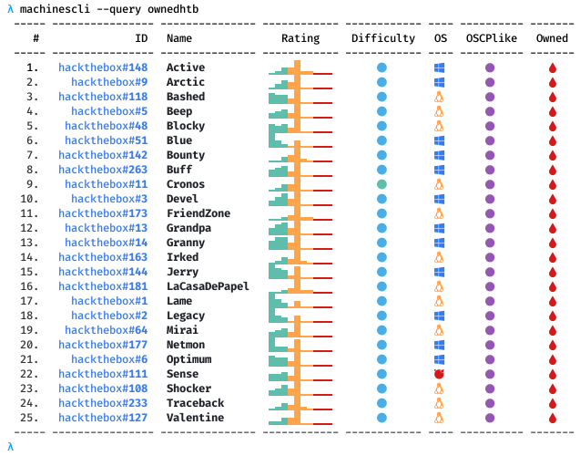

# machinescli

[](https://creativecommons.org/licenses/by-sa/4.0/)

This tool provides commandline access for HackTheBox and VulnHub machines. It can be useful for looking up machine details, interacting with HackTheBox portal, tracking owned/pending machines, etc. It also provides commandline based, [ippsec.rocks](https://ippsec.rocks/?#) like search facility for writeup descriptions and extends it to VulnHub machines as well. It works in conjuction with [svachal](https://github.com/7h3rAm/svachal) framework so all machine writeups metadata is natively accessible:

## Usage


## Usecases
1. Show counts for tracked and owned machines:


1. Show global stats from HackTheBox platform:


1. Show stats for machines named `bashed` and `kioptirx`:


2. Search within machine descriptions for keyword `buffer overflow`:


3. Summarize all writeups:


4. Query writeups using built-in filters:


5. Query writeups using `jq` syntax:


## Argument Autocomplete
There's a `.bash-completion` file that one can source within a shell to trigger auto-complete for arguments. This will, however, require an alias to work which can be created as follows:
```console
alias machinescli='python3 $HOME/toolbox/repos/machinescli/machinescli.py'
```
