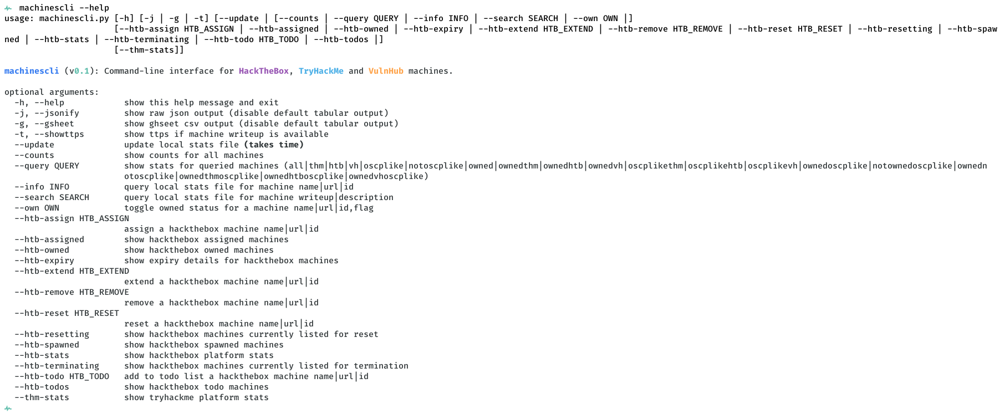
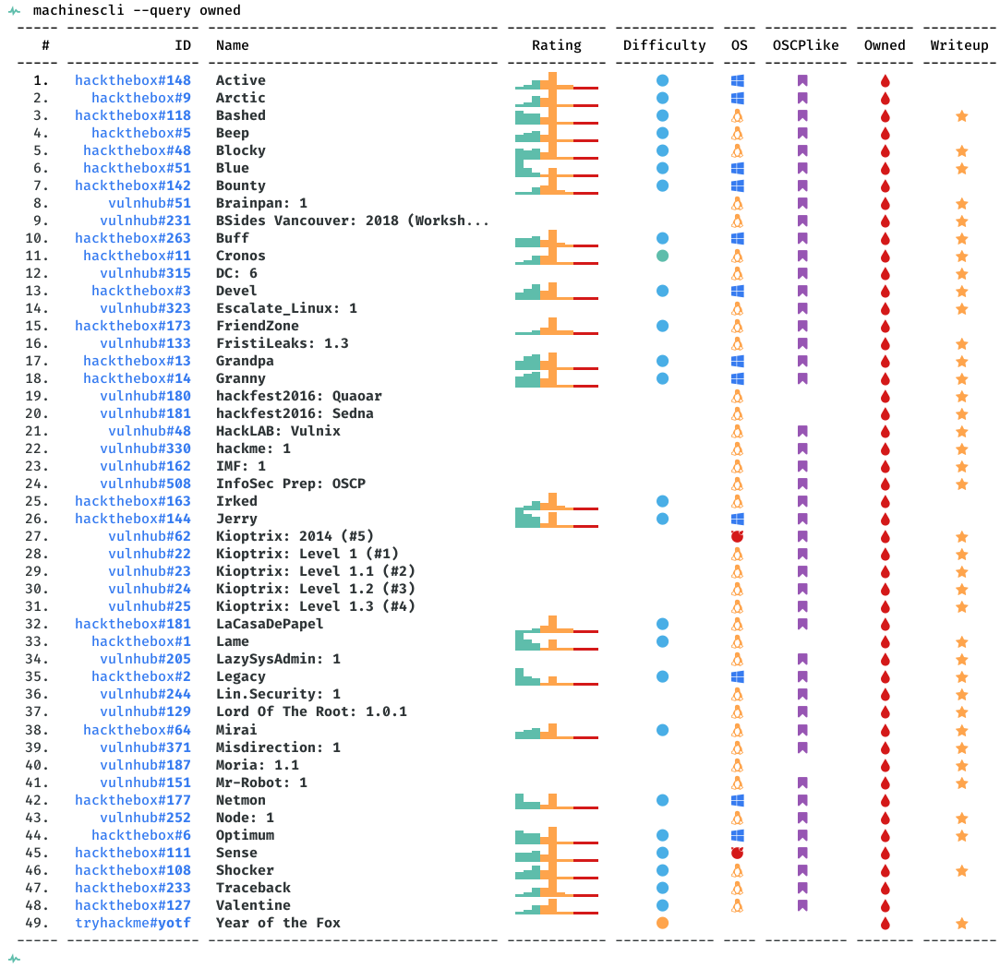
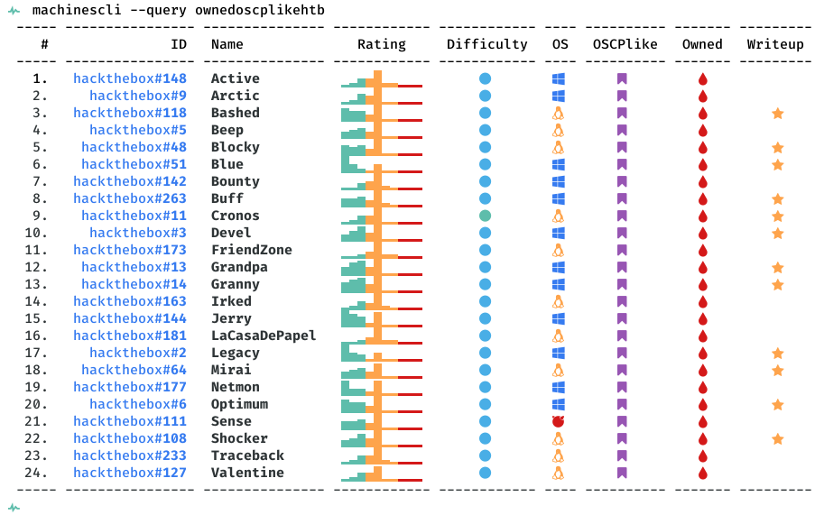

# machinescli

[](https://creativecommons.org/licenses/by-sa/4.0/)

This tool provides commandline access for [HackTheBox](https://www.hackthebox.eu) and [VulnHub](https://www.vulnhub.com/) machines. It can be useful for looking up machine details, interacting with HackTheBox portal, tracking owned/pending machines, etc. It also provides commandline based, [ippsec.rocks](https://ippsec.rocks/?#) like search facility for writeup descriptions and extends it to VulnHub machines as well. It works in conjuction with [svachal](https://github.com/7h3rAm/svachal) framework, so all machine writeups metadata is natively accessible:

## Usage


## Usecases
1. Show counts for tracked and owned machines:


1. Show stats for machines named `bashed` and `kioptrix`:


1. Show stats for machine named `bashed` as JSON:


1. Search machine descriptions for keyword `buffer overflow`:


1. Search machine descriptions for keyword `sqli`:


1. Search machine descriptions for keyword `rpc`:


1. Search machine descriptions for keyword `bash` and format results for GSheet import:


1. Query `owned` machines using the built-in filter:


1. Query `owned HackTheBox` machines using the built-in filter:


1. Query `owned AND NOT OSCPlike` machines using `jq`-style syntax:


1. Show global stats from HackTheBox platform:


1. Show `spawned` machines from HackTheBox platform:


1. Show machine `expiry` stats from HackTheBox platform:


1. Perform machine `assign` and `remove` operations on a HackTheBox machine:


## Argument Autocomplete
Source the `.bash-completion` file within a shell to trigger auto-complete for arguments. This will require the following alias (change path as needed): 
```console
alias machinescli='python3 $HOME/machinescli/machinescli.py'
```
