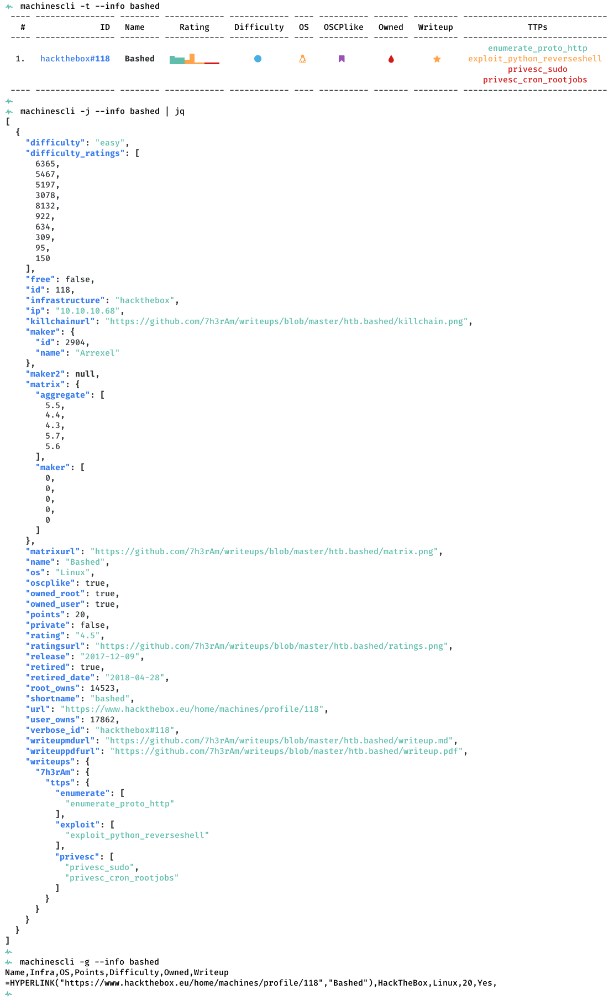
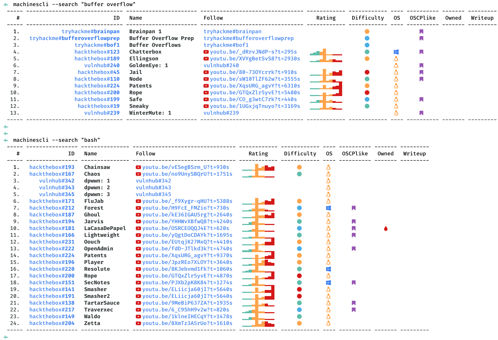
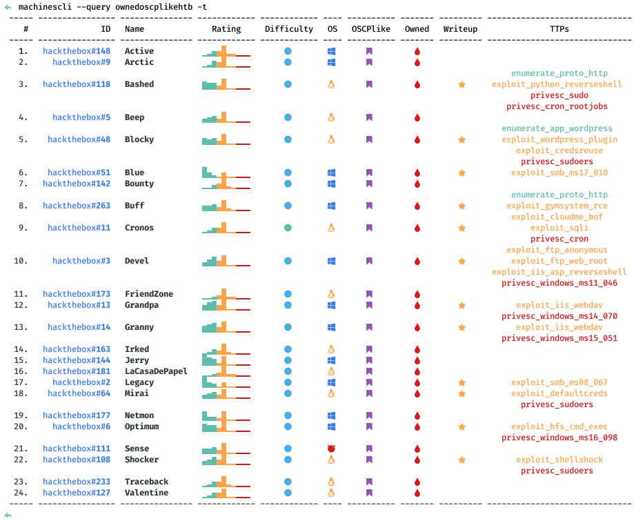
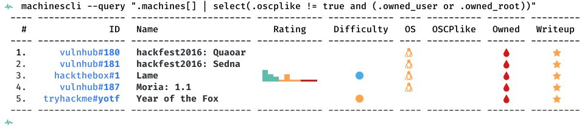
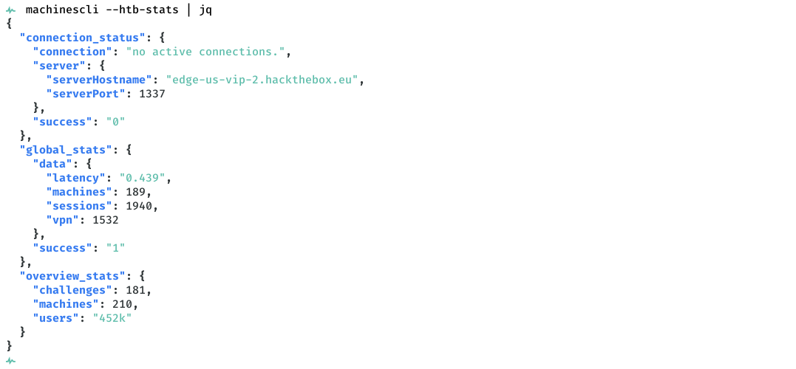
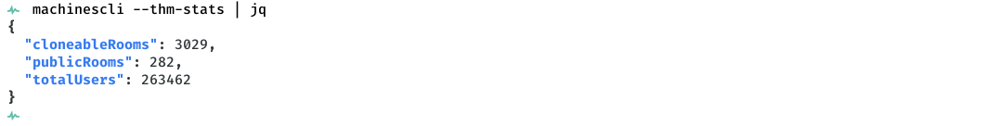

# machinescli

[](https://creativecommons.org/licenses/by-sa/4.0/)

This tool provides commandline access for [HackTheBox](https://www.hackthebox.eu), [TryHackMe](https://tryhackme.com/) and [VulnHub](https://www.vulnhub.com/) machines. Here's a quick listing of useful features:

- Look up machine details across HTB/THM/VH
- Track owned/pending/todo machines
- Interact with HTB portal and assign/remove/own/query machines
- Search writeup descriptions using [ippsec.rocks](https://ippsec.rocks/?#) like option
- Search machine details using `jq`-style query language

> `machinescli` works in conjuction with [svachal](https://github.com/7h3rAm/svachal) framework.
> As such, if you wish to extend and use writeup metadata, it will be natively accessible via the shared `machines.json` file.

## Usage


## Usecases
1. Show counts for tracked and owned machines:


1. Show stats for machine named `bashed`, show extended details as JSON, export results for GSheet import:


1. Search machine descriptions for keywords `buffer overflow`, `sqli` and `bash`. Export results for GSheet import:


1. Query `owned` machines using the built-in filter:


1. Query `owned AND oscplike HackTheBox` machines using the built-in filter:


1. Query `owned AND oscplike HackTheBox` machines using the built-in filter and show TTPs if machine writeups are available:


1. Query `owned AND NOT OSCPlike` machines using `jq`-style syntax:


1. Show global stats from HackTheBox platform:


1. Show `spawned` machines and `expiry` stats from HackTheBox platform:


1. Perform `assign` and `remove` operations on a HackTheBox machine:


1. Show global stats from TryHackMe platform:


## Argument Autocomplete
Source the `.bash-completion` file within a shell to trigger auto-complete for arguments. This will require the following alias (change path as needed): 
```console
alias machinescli='python3 $HOME/machinescli/machinescli.py'
```

> You will need a [Nerd Fonts patched font](https://github.com/ryanoasis/nerd-fonts/tree/master/patched-fonts) for OS icons and other symbols to be rendered correctly.
